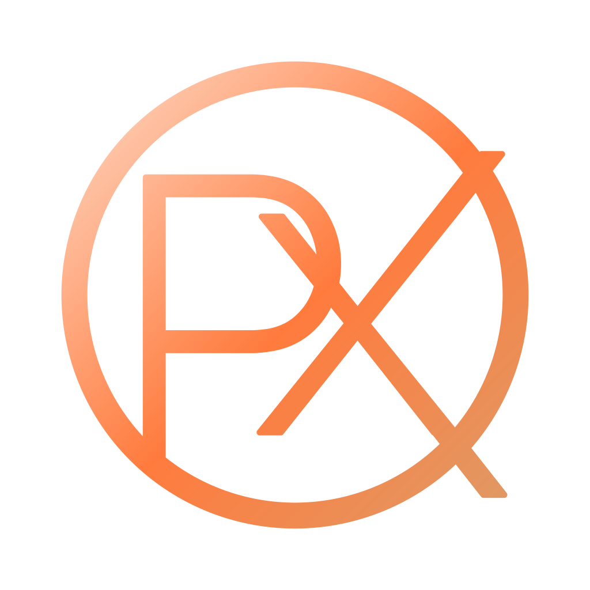

<div align="center">



# Pyrux Portfolio

**The official web presence for Pyrux — a two-person studio building modern websites, custom systems, and digital solutions.**

[](https://nextjs.org/)
[](https://react.dev/)
[](https://www.typescriptlang.org/)
[](https://tailwindcss.com/)
[](https://www.framer.com/motion/)
[](https://pages.github.com/)

[**Live Site**](https://www.pyrux.com.ar) · [**Pricing**](https://www.pyrux.com.ar/en/pricing) · [**Projects**](https://www.pyrux.com.ar/en/projects)

</div>

---

## What is this?

A production-ready portfolio site showcasing Pyrux's services, clients, team, and pricing. It's fully bilingual (Spanish / English), supports dark and light modes, and is deployed as a static site on GitHub Pages — zero server, zero backend, just fast pre-rendered HTML.

---

## Features

### UI & Experience
- **Draggable carousels** — infinite scroll with mouse drag and touch swipe, velocity-based inertia
- **Interactive modals** — project details with image carousel, client testimonials, team member profiles
- **Bottom sheet modals on mobile** — slide-in from bottom with drag-to-dismiss handle
- **Dark / Light mode** — CSS variable design system, persisted to localStorage with FOUC prevention
- **Bilingual (ES / EN)** — powered by `next-intl`, language toggled client-side without page reload
- **Animated hero** — floating SVG logo with gradient-shift keyframe animation
- **Vertical timeline** — process section with staggered scroll animations and decorative step numbers
- **WhatsApp FAB** — floating action button for quick client contact

### Architecture
- **Static export** — full SSG via `output: 'export'`, no server required
- **React 19 + React Compiler** — automatic memoization, zero manual `useMemo`/`useCallback`
- **Server / Client component pattern** — every route has a Server Component (`page.tsx`) for metadata and a Client Component (`*PageClient.tsx`) for all logic and UI
- **Modular pricing page** — fully decomposed into cards, sections, data files, and types
- **All content in `data/`** — locale-aware static arrays, no fetching, no CMS

### SEO
- Structured data (JSON-LD): `Organization`, `LocalBusiness`, `WebSite`, `FAQPage`, `BreadcrumbList`
- Dynamic `sitemap.ts` including all creator routes
- `hreflang` alternate links for bilingual indexing
- Per-route `metadata` with OG and Twitter card images
- Canonical URLs on every page

---

## Tech Stack

| Layer | Technology |
|---|---|
| Framework | Next.js 16.1.6 (App Router) |
| UI | React 19.2.3 |
| Language | TypeScript 5 (strict) |
| Styling | Tailwind CSS v4 |
| Animation | Framer Motion 12 |
| Icons | Lucide React + React Icons |
| i18n | next-intl 4.8.3 |
| Toasts | Sonner 2 |
| Compiler | babel-plugin-react-compiler |
| Deploy | GitHub Pages via GitHub Actions |

---

## Project Structure

```
pyrux_portfolio/
├── app/
│   ├── page.tsx                  # Landing (Server Component)
│   ├── layout.tsx                # Root layout — metadata, theme, FOUC/FOWL scripts
│   ├── globals.css               # CSS variable design system
│   ├── sitemap.ts                # Dynamic XML sitemap
│   ├── pricing/                  # Modular pricing page
│   │   ├── page.tsx
│   │   ├── PricesPageClient.tsx
│   │   ├── components/           # PackageCard, MaintenanceGrid, FAQSection…
│   │   ├── _types/               # pricing.types.ts
│   │   └── _data/                # packages, steps, faq arrays
│   ├── projects/
│   ├── clients/
│   └── creator/[id]/
│
├── components/
│   ├── sections/                 # Hero, OurProjects, OurTeam, OurStack, ContactUs…
│   ├── cards/                    # ProjectCard, CompanyCard, PackageCard…
│   ├── modals/                   # ProjectModal, CompanyModal, CreatorModal
│   ├── ui/                       # Section, Badge, Modal, TechIcon, StarBackground…
│   └── layout/                   # ThemeToggle, LanguageToggle, Footer, WhatsAppFAB
│
├── data/                         # All static content (locale-aware)
│   ├── projects.ts               # Record<Locale, Project[]>
│   ├── companies.ts              # Record<Locale, Company[]>
│   ├── creators.ts               # Record<Locale, Creator[]>
│   ├── personalProjects.ts       # Record<Locale, PersonalProject[]>
│   └── technologies.ts           # Technology[] (26 techs, global)
│
├── hooks/
│   ├── useDraggableMarquee.ts    # Infinite drag carousel
│   ├── useDragScroll.ts          # Image gallery drag scroll
│   └── useCopyToClipboard.ts     # Clipboard with timeout + fallback
│
├── i18n/                         # next-intl config and locale provider
├── messages/                     # es.json, en.json
├── types/index.ts                # Project, Company, Creator, Technology…
└── .github/workflows/deploy.yml  # CI/CD → GitHub Pages
```

---

## Getting Started

```bash
# Clone
git clone https://github.com/your-username/pyrux_portfolio.git
cd pyrux_portfolio/pyrux_portfolio

# Install
npm install

# Dev server (Turbopack)
npm run dev

# Production build (static export → out/)
npm run build

# Lint
npm run lint
```

> All commands run from the `pyrux_portfolio/` subdirectory.

---

## Design System

The site uses a CSS variable design system defined in `globals.css` with two complete themes (dark default, light mode):

```css
/* Core tokens — fully inverted in light mode */
--color-bg            /* Deep background */
--color-surface       /* Card / surface */
--color-surface-elevated
--color-text          /* Primary text */
--color-text-secondary
--color-text-muted
--color-coral         /* Primary accent */
--color-cyan          /* Secondary accent */
```

All Tailwind utilities reference these variables — no hardcoded color values anywhere in the codebase.

---

## Animation Patterns

All animations use Framer Motion. The standard pattern for staggered scroll entrance:

```tsx
const container = {
  hidden: { opacity: 0 },
  visible: { opacity: 1, transition: { staggerChildren: 0.1 } },
};
const item = {
  hidden: { opacity: 0, y: 20 },
  visible: { opacity: 1, y: 0 },
};

<motion.div variants={container} initial="hidden" whileInView="visible" viewport={{ once: true }}>
  {items.map((item) => (
    <motion.div key={item.id} variants={item} />
  ))}
</motion.div>
```

Rules:
- Never `useEffect` for animations — always Framer Motion
- Never inline styles — always Tailwind utilities
- All transitions minimum 600ms with `ease-in-out`

---

## Deployment

Push to `main` triggers the GitHub Actions workflow:

1. Installs dependencies with `npm ci`
2. Runs `npm run build` — outputs static files to `pyrux_portfolio/out/`
3. Deploys to GitHub Pages

No server, no database, no runtime — pure static HTML/CSS/JS.

---

## Content

All content lives in `data/` as TypeScript arrays. To update content:

- **Projects** → `data/projects.ts`
- **Clients / Companies** → `data/companies.ts`
- **Team members** → `data/creators.ts`
- **Personal projects** → `data/personalProjects.ts`
- **Technologies** → `data/technologies.ts`
- **UI copy** → `messages/es.json` and `messages/en.json`

No code changes needed — just edit the data files.

---

## Roadmap

- [ ] Locale routing via URL segments (`/es/`, `/en/`) for proper bilingual SEO
- [ ] Real project images and team photos
- [ ] LinkedIn integration in structured data
- [ ] Google Search Console sitemap submission

---

<div align="center">

Built by [Juan Manuel García](https://github.com/LittleBigPants) and [Gino Ruben Giorgi](https://github.com/ginogiorgi) · [pyrux.com.ar](https://www.pyrux.com.ar)

</div>
